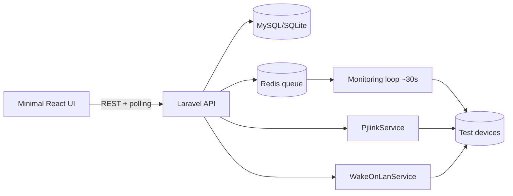

# Proof of Concept (POC) — PRD
## Device Power Management System (DPMS)

| Field | Value |
|---|---|
| **Document** | POC Product Requirements Document |
| **Project** | Device Power Management System (DPMS) |
| **Companion to** | DPMS PRD v1.0 and DPMS Quotation & Timeline |
| **Version** | 1.0 |
| **Status** | Draft for approval |
| **Date** | 2026-06-25 |
| **Duration** | ~3 weeks |
| **Team** | 1 senior full-stack dev (+ 1 part-time backend dev) |

> **Purpose of a POC:** prove the *riskiest technical assumptions* of DPMS against **real devices on the real network** before committing to the full ~4-month build. A POC is intentionally throwaway-grade: minimal UI, minimal data, no production hardening. It answers "will this work here?" — not "is this production-ready?"

---

## 1. Objective

Demonstrate, end-to-end on a small set of real devices, that DPMS can: (a) **monitor** device reachability, (b) **power projectors on/off and read telemetry via PJLink**, and (c) **wake devices via Wake-on-LAN** — including across VLANs if applicable. Success de-risks the program; failure surfaces blockers (network, protocol, vendor) while they are cheap to fix.

---

## 2. Hypotheses to validate (the whole point of the POC)

| # | Hypothesis | Why it's risky |
|---|---|---|
| H1 | We can reach and **ping-monitor** the target devices on a 30s loop and detect online→offline transitions. | ICMP may be blocked on some segments; needs TCP fallback. |
| H2 | We can **power projectors on/off and read status, lamp hours, errors, temperature via PJLink** from the app server. | Vendor/model PJLink support, auth handshake, and TCP 4352 reachability vary. |
| H3 | We can **wake a powered-down device via Wake-on-LAN** in the same subnet. | Magic packet delivery, NIC/BIOS WoL settings. |
| H4 | **Cross-VLAN Wake-on-LAN** works (or we identify exactly what's needed: directed broadcast / relay / agent). | This is the single biggest unknown in the program. |
| H5 | The chosen stack (Laravel queues + PJLink/WoL services) is a sound foundation to scale to ~150 devices. | Validates architecture direction early. |

**The POC is considered successful primarily on H1–H4.** H5 is a qualitative engineering judgment.

---

## 3. Scope

### 3.1 In scope (minimum to prove the hypotheses)

A minimal Laravel 12 + React app that lets a single admin: see a small device list with **live online/offline status** and **last seen**; click **Power On / Power Off / Get Status** on a projector via PJLink and view its **lamp hours, errors, temperature**; click **Wake** on a WoL device; and trigger a **single cross-VLAN WoL test**. Reachability monitoring runs on a queue/loop. Basic single-user login only.

### 3.2 Out of scope (deliberately deferred to the full build)

RBAC and the 4 roles; full device CRUD/validation/import; location hierarchy, groups, departments; bulk operations; scheduling; notifications (email/Slack/web); reports and PDF/Excel/CSV export; audit logging; the full REST API surface and API Resources; WebSocket-based live UI (simple polling is fine for the POC); production security hardening, tests beyond smoke tests, and documentation beyond a short findings note.

### 3.3 Target environment

A small, representative set: **5–10 real devices** in **one building/floor**, including at least **2 PJLink projectors**, **2 WoL-capable PCs in the same VLAN**, and **1 WoL device on a different VLAN** (to test H4). Devices, IPs, MACs, and VLANs to be provided before kickoff.

---

## 4. POC success criteria (exit decision)

| ID | Criterion | Pass condition |
|---|---|---|
| SC-1 (H1) | Reachability monitoring | App detects each test device as online/offline within one 30s cycle; ICMP or TCP-fallback confirmed. |
| SC-2 (H2) | PJLink control | Power on, power off, and status succeed on ≥ 2 projectors; lamp hours, errors, temperature read correctly. |
| SC-3 (H3) | Same-VLAN WoL | At least 1 powered-down PC wakes reliably via magic packet. |
| SC-4 (H4) | Cross-VLAN WoL | Either cross-VLAN wake succeeds, **or** the exact requirement (directed broadcast / relay / per-subnet agent) is identified and documented. |
| SC-5 (H5) | Architecture confidence | Team confirms the service/queue design scales to ~150 devices, with risks noted. |

**Go / No-Go:** Proceed to full build if SC-1, SC-2, SC-3 pass and SC-4 is resolved (pass or with a documented, costed workaround).

---

## 5. Minimal functional requirements

| ID | Requirement |
|---|---|
| POC-01 | Single admin login (seeded credentials; no RBAC). |
| POC-02 | Hard-coded/seeded list of 5–10 devices (name, type, IP, MAC, VLAN). |
| POC-03 | Background reachability check (~30s) updating status + last_seen, with ICMP and TCP-port fallback. |
| POC-04 | PJLink service: power_on, power_off, get_power_status, get_lamp_hours, get_errors, get_temperature. |
| POC-05 | WoL service: wake(mac) for a single device; plus a cross-VLAN wake test path. |
| POC-06 | Minimal React page: device list with status, last seen, and action buttons (Power On/Off/Status/Wake); results shown inline. |
| POC-07 | Lightweight action log (console/DB row) capturing command + result for the findings report (not full audit). |

---

## 6. Minimal architecture & data

Same stack direction as the full PRD, trimmed: **Laravel 12 / PHP 8.4**, **MySQL** (or even SQLite for the POC), **Redis** for the monitoring queue, a **React + TypeScript** single page using **polling** (no Reverb yet). Two reusable service classes are built and carried forward to production: **`PjlinkService`** (TCP 4352, auth handshake, command set) and **`WakeOnLanService`** (magic packet, with a cross-VLAN strategy hook). Minimal tables: `devices` (id, name, type, ip, mac, vlan, status, last_seen) and `poc_action_logs` (id, device_id, action, result, detail, created_at).

---

## 7. Test plan

Validate each hypothesis directly against the test devices: confirm online detection, then physically/remotely power a device down and confirm offline detection within one cycle (H1); issue PJLink on/off/status and verify projector response and telemetry accuracy against the projector's own panel (H2); wake a same-VLAN PC from S5/off (H3); attempt cross-VLAN wake and, if it fails, test directed-broadcast/relay options and record what works (H4). Capture every command and result in the action log for the findings report.

---

## 8. Timeline (~3 weeks)

| Week | Focus | Outcome |
|---|---|---|
| **1** | Scaffold, seeded devices, login, monitoring loop (H1) | Live status visible for test devices |
| **2** | `PjlinkService` + power/telemetry (H2); same-VLAN WoL (H3) | Projector control + single wake working |
| **3** | Cross-VLAN WoL testing (H4), minimal UI polish, findings report | Go/No-Go decision package |

**Total effort ≈ 29 person-days** across 1 full-time senior developer plus a part-time backend developer over ~3 calendar weeks. A single developer working alone would take ~5–6 weeks.

---

## 9. Budget estimate (BDT)

| Line item | Calculation | Cost (BDT) |
|---|---|---:|
| Senior full-stack dev | 160,000/mo × 0.75 mo (3 wks) | 120,000 |
| Backend dev (part-time ~50%, PJLink/WoL) | 100,000/mo × 0.75 × 0.5 | 37,500 |
| Infra & test setup | dev server, Redis, network/test-lab access | 30,000 |
| **Subtotal** | | **187,500** |
| Contingency (10%) | | 18,750 |
| **POC total** | | **≈ 206,250** |

**Planning figure: roughly BDT 2,00,000 – 2,50,000** (~0.2M), depending on whether the second developer is needed and how much network/lab support the cross-VLAN test requires. This is a small fraction of the full build (~BDT 1.6M–2.1M) and is the cheapest place to discover blockers.

---

## 10. Deliverables

A running minimal app demonstrating H1–H4 on real devices; the reusable `PjlinkService` and `WakeOnLanService` classes (carried into production); and a short **POC Findings & Recommendation report** covering what passed/failed, the cross-VLAN WoL conclusion, any network/vendor blockers, and a Go/No-Go recommendation with any adjustments to the full-build estimate.

---

## 11. Risks & assumptions

Assumes timely access to representative test devices, their network details (IP/MAC/VLAN), and a window to power devices off/on for testing, plus network-team availability for the cross-VLAN test. The dominant risk remains **cross-VLAN Wake-on-LAN** (may require switch directed-broadcast config or a per-subnet relay/agent) and **non-PJLink or quirky-vendor projectors**; both are exactly what this POC exists to expose early, before the full budget is committed.
