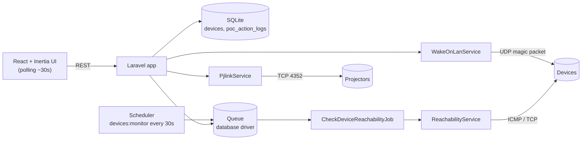
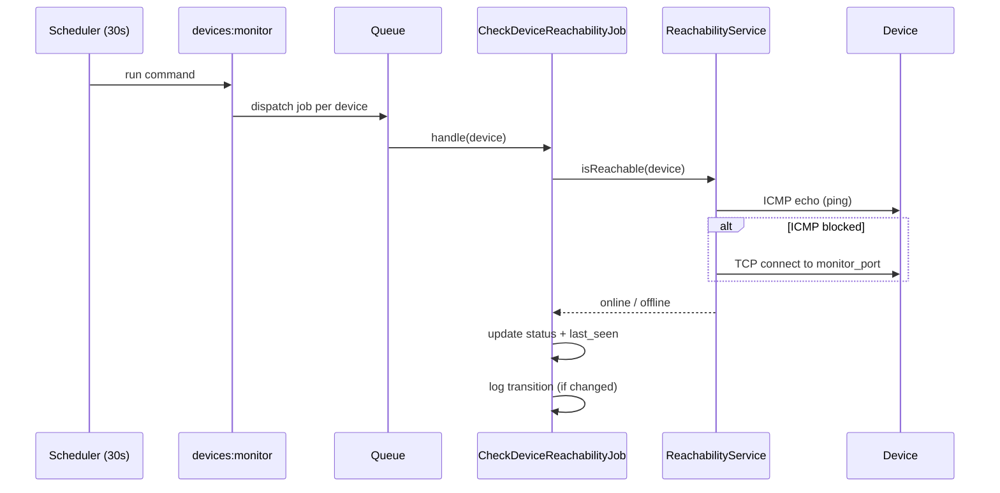
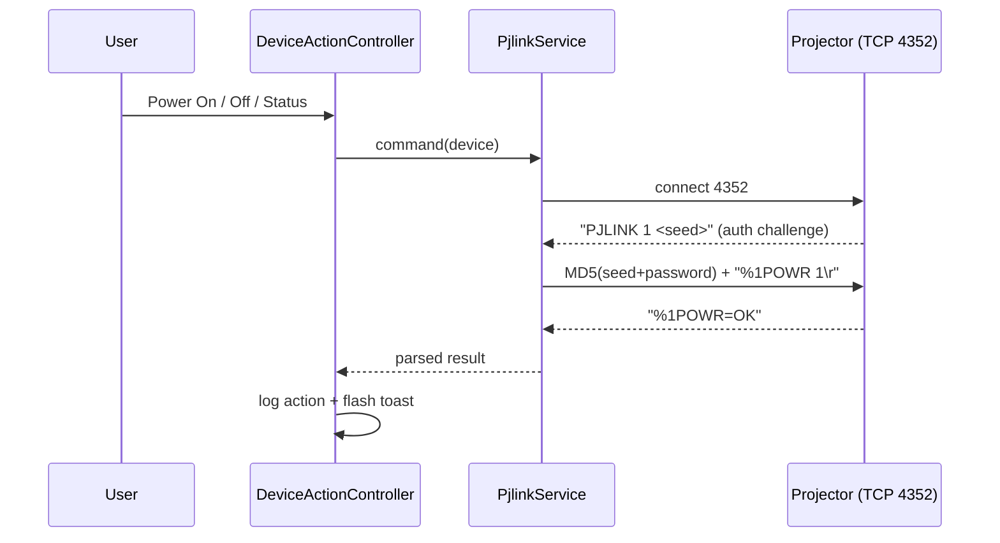
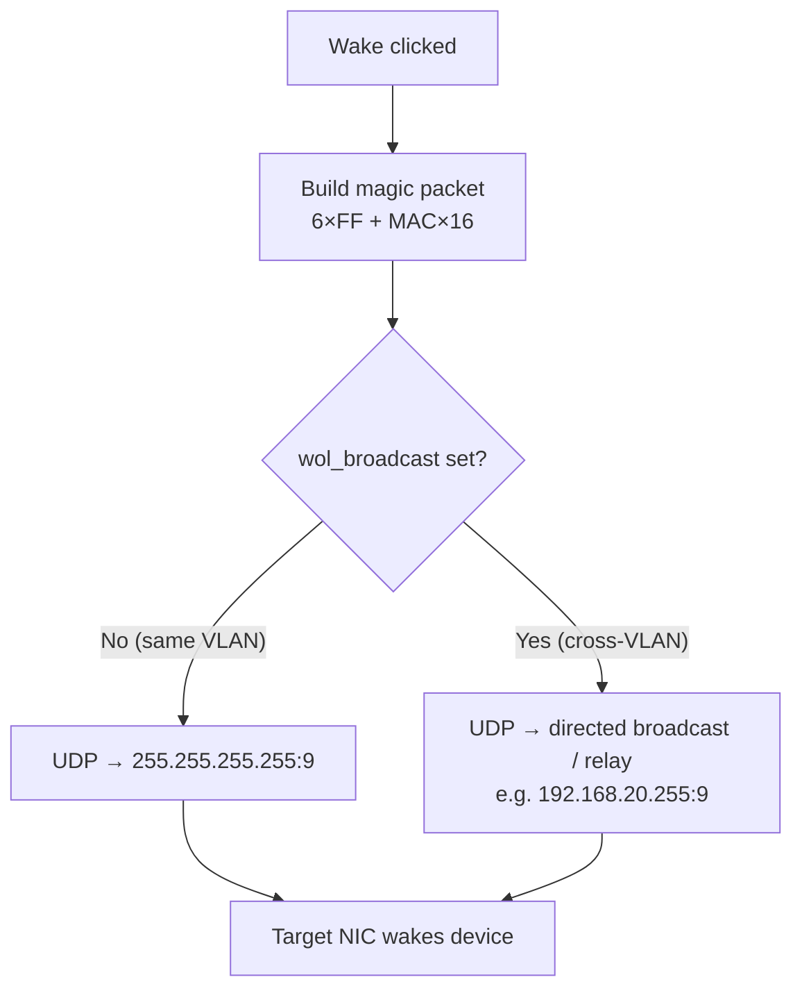
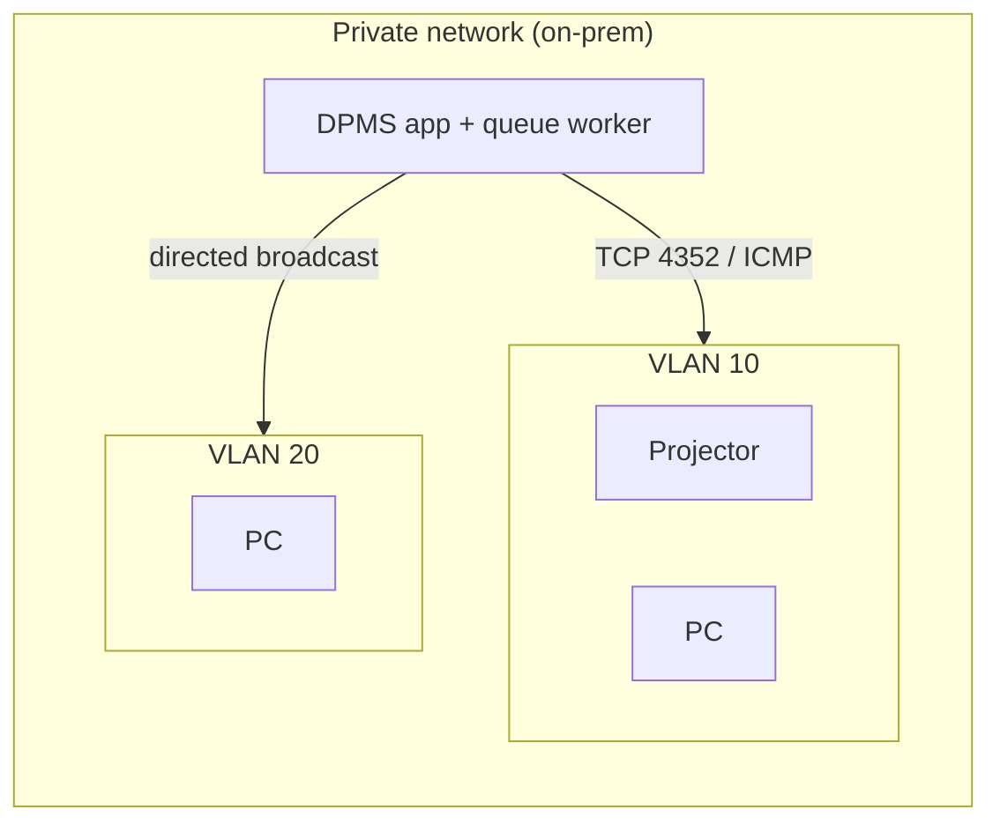
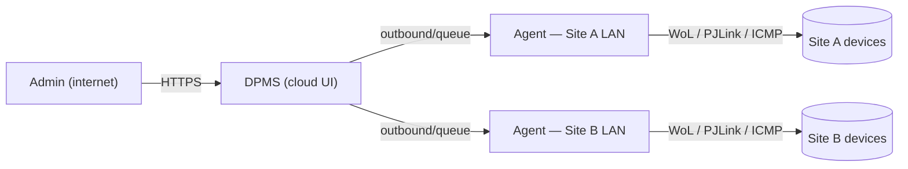
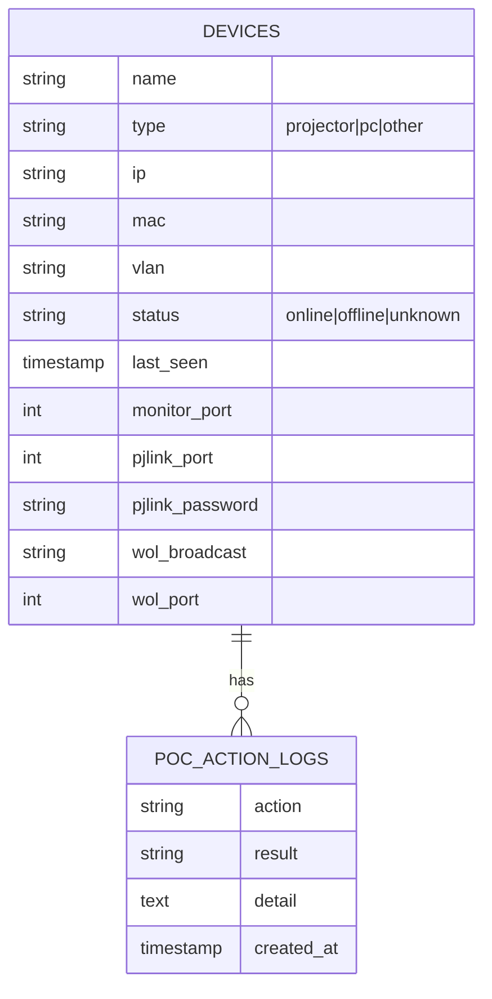

# DPMS — Device Power Management System (POC)

A proof-of-concept that monitors device reachability and remotely controls
devices on the real network: **ping/TCP monitoring**, **PJLink projector
control + telemetry**, and **Wake-on-LAN** (including a cross-VLAN strategy).

> **Status:** Proof of concept. Minimal UI, single admin, throwaway-grade.
> It exists to de-risk the four technical unknowns below before the full build.

| Hypothesis | What it proves |
|---|---|
| **H1** | Reach + ping-monitor devices on a ~30s loop; detect online↔offline. |
| **H2** | Power projectors on/off and read status, lamp hours, errors, temperature via PJLink. |
| **H3** | Wake a powered-down PC via Wake-on-LAN on the same subnet. |
| **H4** | Wake a device across VLANs (or identify exactly what's required). |

---

## Table of contents

- [Architecture](#architecture)
- [How it works](#how-it-works)
  - [1. Reachability monitoring (H1)](#1-reachability-monitoring-h1)
  - [2. PJLink projector control (H2)](#2-pjlink-projector-control-h2)
  - [3. Wake-on-LAN (H3 / H4)](#3-wake-on-lan-h3--h4)
- [Setup](#setup)
  - [Running](#running)
- [Network dependencies](#network-dependencies)
- [Network configuration](#network-configuration)
- [Deployment & network topology](#deployment--network-topology)
- [Data model](#data-model)
- [Services](#services)
- [Testing](#testing)
- [Project map](#project-map)

---

## Architecture



**Stack:** Laravel 13 / PHP 8.3 · Inertia v3 + React 19 + TypeScript ·
Tailwind v4 · SQLite · database queue · Pest 4. UI is a ported multi-theme
admin template (light/dark, primary presets, layout modes, RTL) with a theme
customizer.

---

## How it works

### 1. Reachability monitoring (H1)

The scheduler dispatches one job per device every 30 seconds. Each job checks
reachability and records online↔offline transitions to the action log.



ICMP is the primary probe; if it is blocked on a segment, a TCP connect to the
device's `monitor_port` is the fallback.

### 2. PJLink projector control (H2)



Supported commands: `power_on`, `power_off`, `get_power_status`,
`get_lamp_hours`, `get_errors`, `get_temperature` (PJLink Class 1 over TCP 4352,
with the MD5 auth handshake when the projector requires a password).

### 3. Wake-on-LAN (H3 / H4)



Same-subnet wakes use the limited broadcast. Cross-VLAN wakes target a
**directed broadcast** (or a per-subnet relay) configured per device via
`wol_broadcast` — the single biggest network unknown the POC exists to expose.

---

## Setup

**Requirements:** PHP 8.3+, Composer, Node 20+, npm. (Laravel Herd serves the
app at `http://dpms.test` automatically; otherwise use `php artisan serve`.)

```bash
composer install
npm install

cp .env.example .env
php artisan key:generate

touch database/database.sqlite
php artisan migrate --seed
npm run build
```

Seeded admin login: **`admin@dpms.test`** / **`password`**.

> Edit `database/seeders/DeviceSeeder.php` (or use the in-app **Add device**
> modal) to register your real devices — name, type, IP, MAC, VLAN, ports,
> PJLink password, and `wol_broadcast` for cross-VLAN targets.

### Running

```bash
# App + queue worker + Vite + logs (one command)
composer run dev

# Monitoring loop — REQUIRED for live status, run in a separate terminal
php artisan schedule:work
```

`composer run dev` runs the dev server, a queue worker, Vite, and Pail logs.
The 30-second reachability loop is driven by the **scheduler**, so
`schedule:work` must run too. To check once manually: `php artisan devices:monitor`
(the queue worker then processes the dispatched jobs).

In production the scheduler is a single cron entry:
`* * * * * cd /path && php artisan schedule:run >> /dev/null 2>&1`.

---

## Network dependencies

The **app server must reach the device network** with these protocols:

| Protocol | Port | Direction | Purpose |
|---|---|---|---|
| ICMP echo | — | app → device | Primary reachability ping (H1) |
| TCP | device `monitor_port` (e.g. 3389, 22, 4352) | app → device | Reachability fallback when ICMP is blocked |
| TCP | 4352 | app → projector | PJLink control + telemetry (H2) |
| UDP | 9 (or 7) | app → subnet broadcast | Wake-on-LAN magic packet (H3/H4) |

PHP extension `sockets` must be enabled (UDP magic packets). ICMP uses the
system `ping` binary.

---

## Network configuration

### Reachability (H1)
- Allow the app server's outbound **ICMP** to the device subnets.
- Where ICMP is filtered, set each device's `monitor_port` to an always-open
  TCP port (RDP 3389, SSH 22, PJLink 4352, …) for the fallback.

### PJLink (H2)
- Enable **PJLink / network control** in the projector's on-screen menu.
- Open **TCP 4352** from the app server to the projector.
- If the projector enforces auth, store its PJLink password on the device
  record (`pjlink_password`).
- Note: PJLink Class 1 exposes temperature only as a fault flag in the error
  status (`ERST`); a numeric temperature needs a Class 2 / vendor command.

### Wake-on-LAN, same VLAN (H3)
- **BIOS/UEFI:** enable *Wake on LAN* / *Power On by PCI-E* / *ErP off*.
- **OS NIC:** enable "Allow this device to wake the computer" (+ "Only a magic
  packet"). On Windows, **disable Fast Startup** (it breaks WoL from full
  shutdown).
- Keep the device powered at the wall (NIC needs standby power).

### Wake-on-LAN, cross-VLAN (H4)
A layer-2 magic packet does **not** cross VLAN boundaries. Pick one:

1. **Directed broadcast (recommended to test first)** — enable
   `ip directed-broadcast` on the destination VLAN's SVI (gateway), guarded by
   an ACL that permits only the app server. Send the packet to that subnet's
   broadcast address (e.g. `192.168.20.255`) via the device's `wol_broadcast`.
2. **Per-subnet relay / agent** — a small service inside the target VLAN that
   receives a trigger and re-emits the magic packet locally.
3. **Switch/controller WoL relay** — vendor feature on some managed switches.

Record the working approach per device in `wol_broadcast`; leave it empty for
same-subnet devices (defaults to `255.255.255.255`).

---

## Deployment & network topology

**DPMS must run on the same private network as the devices it controls.** It is
not designed to reach devices directly over the public internet — the control
protocols are LAN protocols:

| Function | Protocol | Internet-routable? |
|---|---|---|
| Wake-on-LAN | UDP magic packet — broadcast / layer-2 | **No** — broadcasts don't cross routers. Must originate inside the target subnet (directed broadcast or a relay). |
| PJLink | TCP 4352, plaintext + MD5 auth | Routable, but unencrypted — unsafe on the public internet; projectors use private IPs. |
| Reachability | ICMP / TCP | Needs IP reach to the devices' private addresses. |

WoL is the hard constraint: the host sending the packet must sit inside the
device's broadcast domain (or use a directed broadcast / relay within the routed
private network).

### Single-site (the POC)

App and devices on the same routed private network; cross-VLAN wakes use the
`wol_broadcast` directed-broadcast hook.



### Remote operation (expose the UI, not device traffic)

To operate it remotely, keep server→device traffic on the LAN and expose only
the web UI:

1. **On-prem server + remote admin (simplest).** Host DPMS inside the LAN; reach
   the UI over the internet via VPN, Cloudflare Tunnel, or a reverse proxy.
   Device traffic never leaves the LAN.
2. **Cloud app + site-to-site VPN.** Cloud-hosted UI with a private route into
   the LAN. WoL still needs an in-subnet origin, so add a per-subnet relay.
3. **Per-site agent (multi-site scale).** A central app commands a small agent
   inside each site's LAN; the agent performs WoL / PJLink / ping locally and
   reports back. Best when controlling devices across many buildings.



The POC targets the single-site model. For a production multi-site rollout the
per-site agent pattern is the recommended direction (note it in the findings
report).

---

## Data model



`poc_action_logs` is the lightweight audit trail for the findings report — every
monitor transition and control command (command + result + detail) is recorded.

---

## Services

Reusable classes built to carry forward into the production build:

- **`App\Services\PjlinkService`** — PJLink Class 1 client (auth handshake,
  command set, response parsing).
- **`App\Services\WakeOnLanService`** — magic-packet builder + UDP sender with
  the cross-VLAN broadcast hook.
- **`App\Services\ReachabilityService`** — ICMP ping with TCP-port fallback.

All three isolate their network I/O behind protected methods so they are unit
tested without touching the network.

---

## Testing

```bash
php artisan test            # full suite (Pest)
php artisan test --compact  # condensed output
composer test               # config clear + lint + types + tests
```

Coverage: PJLink parsing/auth, WoL packet construction + broadcast selection,
reachability decision logic, device CRUD + validation, the monitoring job, and
the dashboard/device endpoints.

---

## Project map

```
app/
  Console/Commands/MonitorDevicesCommand.php   # devices:monitor
  Enums/                                        # DeviceType, DeviceStatus
  Http/Controllers/                             # Dashboard, Device, DeviceAction
  Http/Requests/DeviceRequest.php               # validation
  Jobs/CheckDeviceReachabilityJob.php
  Models/                                        # Device, PocActionLog
  Services/                                       # Pjlink, WakeOnLan, Reachability
database/
  migrations/  factories/  seeders/DeviceSeeder.php
resources/js/
  pages/dashboard.tsx  pages/devices/index.tsx
  components/                                    # shell, navbar, customizer, modal
  hooks/use-theme.tsx                            # theme engine
routes/
  web.php  console.php                           # routes + 30s schedule
```
